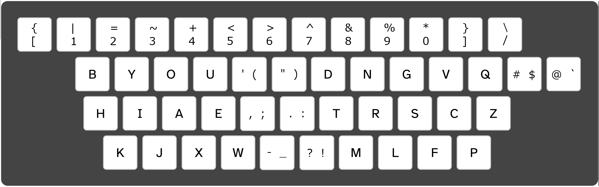
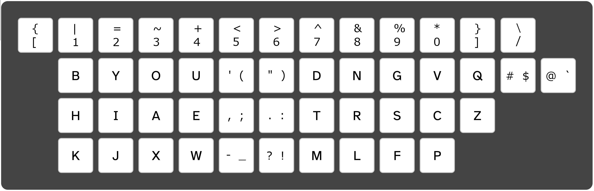
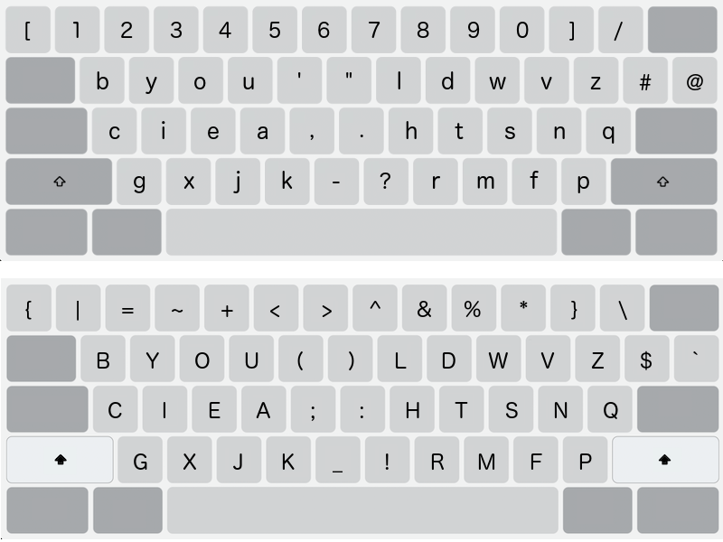
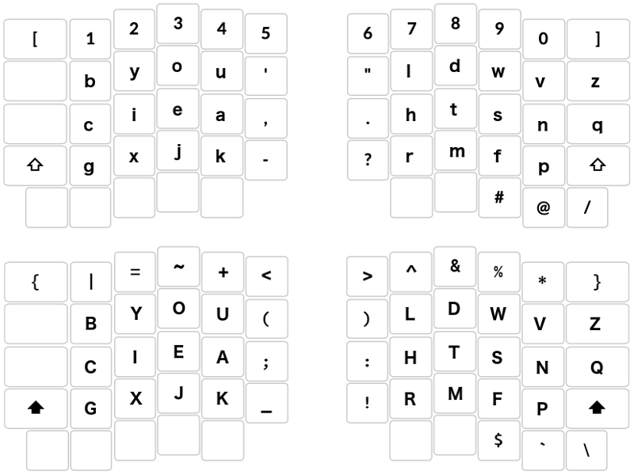
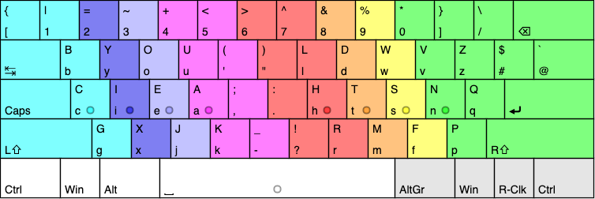
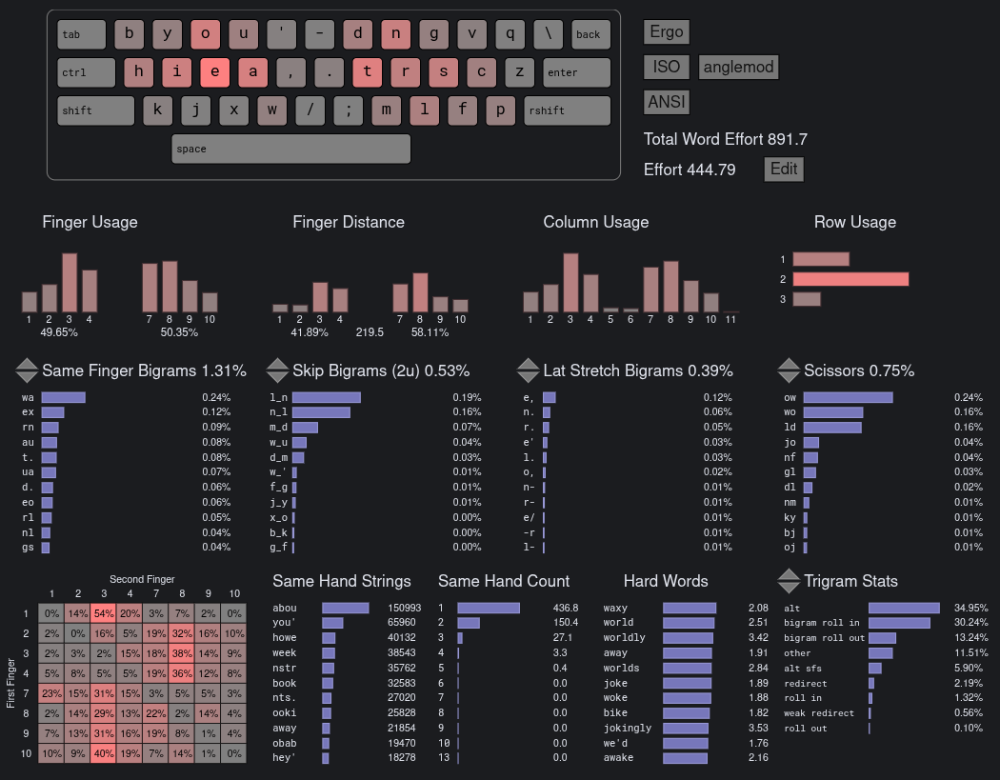
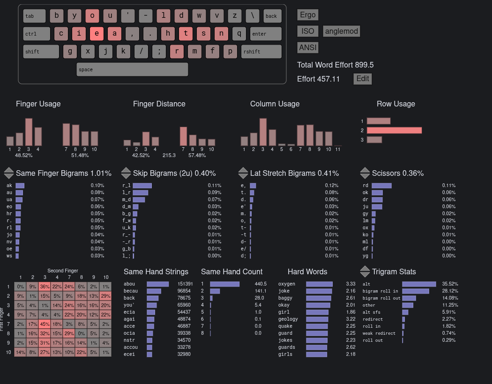

# Engram layouts 2025 and 2021

- modified installation script
- can install both at the same time
- naming Engram2025, Engram2021

## Engram2025
[link repo](https://github.com/binarybottle/engram)

## Engram2021
[link repo](https://github.com/binarybottle/engram-2021)

## Cyanophage Comparison
[link site](https://cyanophage.github.io/index.html)
Result: Engram2025 is better than Engram2021

Engram2025

Engram2021

